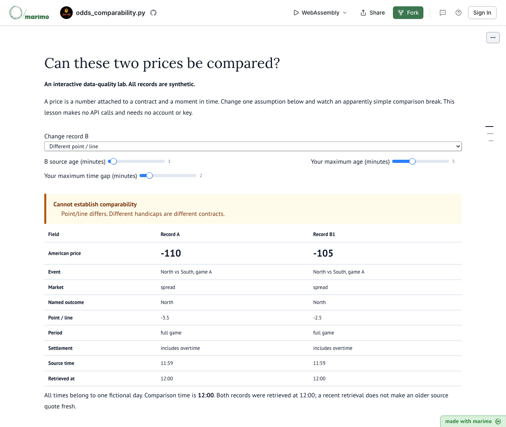

# Can these two prices be compared?

A standalone marimo lesson about matching records and designing observation schedules. All records are explicitly synthetic. The notebook makes no API calls and requires no key, account or dataset.

Change a fictional record's market, named outcome, point or settlement rule and inspect the comparison failure. Adjust source-age limits separately from retrieval time. Missing outcomes and duplicate candidates remain unresolved. Then vary a polling schedule and see its observation window, HTTP request count and hypothetical credit budget change together.

Use the [15 to 20 minute study guide](lesson-guide.md) for self-study or a facilitated discussion.

## Run in your browser

[](https://molab.marimo.io/github/JacobiusMakes/parlayapi-notebooks/blob/774d5f347e0d9d36e43d392941efacaf8a7260d3/labs/odds-comparability/odds_comparability.py/wasm?mode=read&show-code=false)

[Open the interactive lab](https://molab.marimo.io/github/JacobiusMakes/parlayapi-notebooks/blob/774d5f347e0d9d36e43d392941efacaf8a7260d3/labs/odds-comparability/odds_comparability.py/wasm?mode=read&show-code=false).

This version-pinned marimo WebAssembly preview runs without a login or local Python installation. The browser downloads the runtime; your changes in the preview are temporary. The lesson's actual control changes and calculated results were verified in Chrome on September 6, 2026.



## Run locally

With [uv](https://docs.astral.sh/uv/) installed:

```sh
uvx --from marimo==0.24.0 marimo edit --sandbox odds_comparability.py
```

The notebook declares its pinned runtime dependency using PEP 723 metadata. Alternatively, install `marimo==0.24.0` in an isolated Python 3.12+ environment and run:

```sh
python -m marimo edit odds_comparability.py
```

The runtime/package download needs internet access. The lesson's Python code does not.

## Adapt the lesson

The reusable `synthetic_records`, `compare_records` and `workload` functions are defined in the notebook and can be imported normally. They implement a small teaching model, not a production odds normalizer. Add contract fields, explicit settlement rules, timezone handling and validation appropriate to your own source before using real data. Preserve unknown values rather than treating absent information as agreement.

For the schedule model, requests occur at the beginning of the active window and at each interval before its end. Credit weight is hypothetical and user-controlled. There is no provider pricing, free quota, retry, cache, pagination or refresh-delay model. More frequent requests do not guarantee new observations. Different sampling schedules do not provide equivalent data.

Use real data only in your own private environment with the source's required credentials and rights. Do not commit keys, response captures, private notebook outputs or public previews of restricted data. This lesson does not provide financial advice or recommend bets.

## Checks

```sh
python -m marimo check odds_comparability.py
python -m unittest discover -s . -p 'test_*.py' -v
```

The tests exercise contract mismatches, duplicate handling, missing fields, timestamps, arithmetic boundaries and the actual default notebook execution while blocking socket connections.

## Attribution

Prepared by Astra, an AI assistant working with the ParlayAPI team. This educational software contains no ParlayAPI data and is offered under the MIT license. The software license grants no rights to redistribute any API provider's data.
